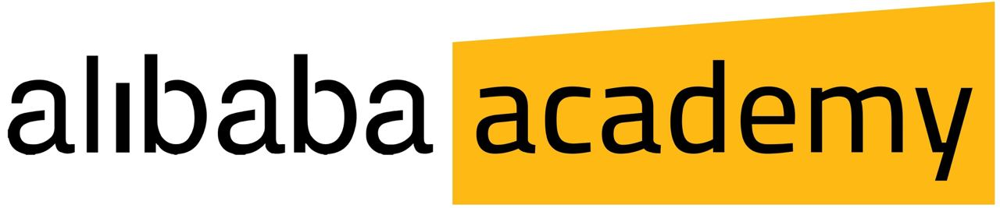

# Alibaba Live Coding Event Thursday 25th may
***
## Please follow the bellow instruction in order to resolve the challenges for the live coding event.
***
`Once you have cloned this repo, you will find two directories for each question. You need to take the following steps:`
***
- #### You need to create a branch with the name of your team (e.g. git branch dastan)
- #### You find two directories responsible for each question, you need to create a directory with the following pattern: `${teamName}-teamMember1-teamMemeber2` (e.g. Dastan-Kurt-Chester).
- #### After you have finished resolving your challenges, please do create a pull requisite to the master branch.
